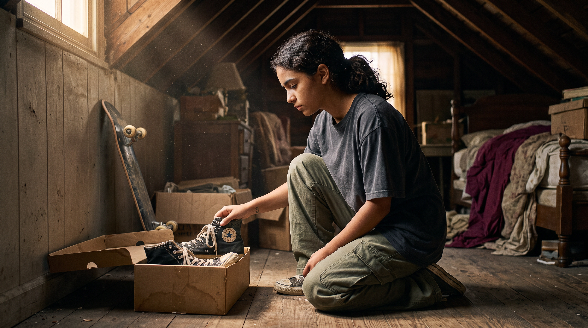
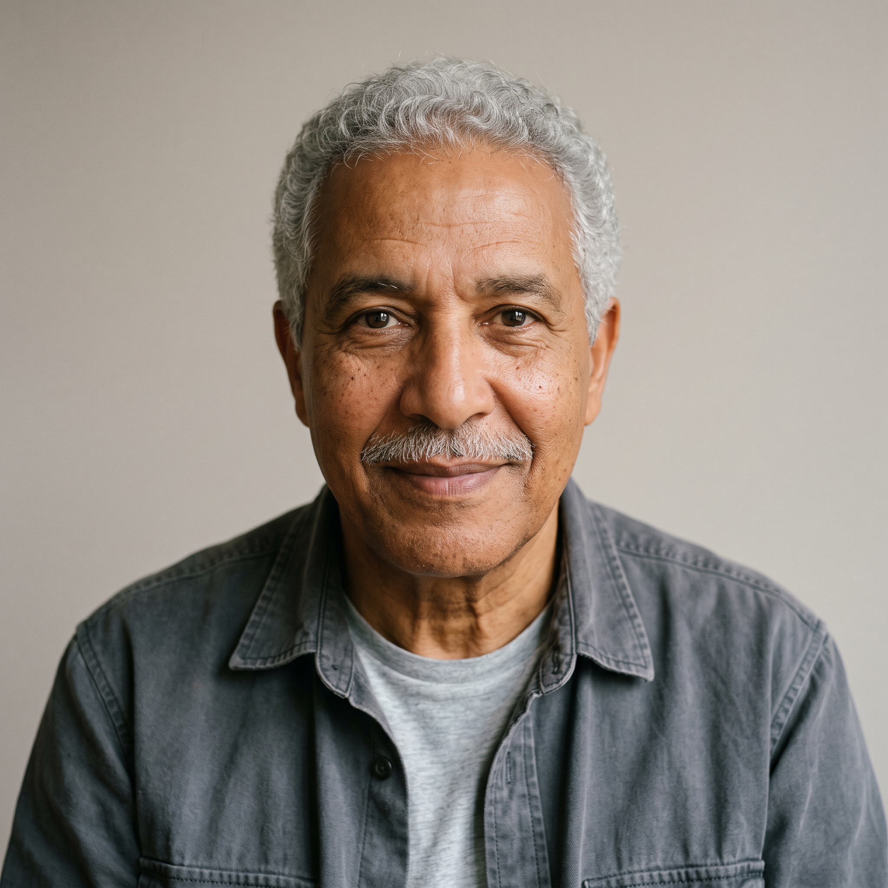
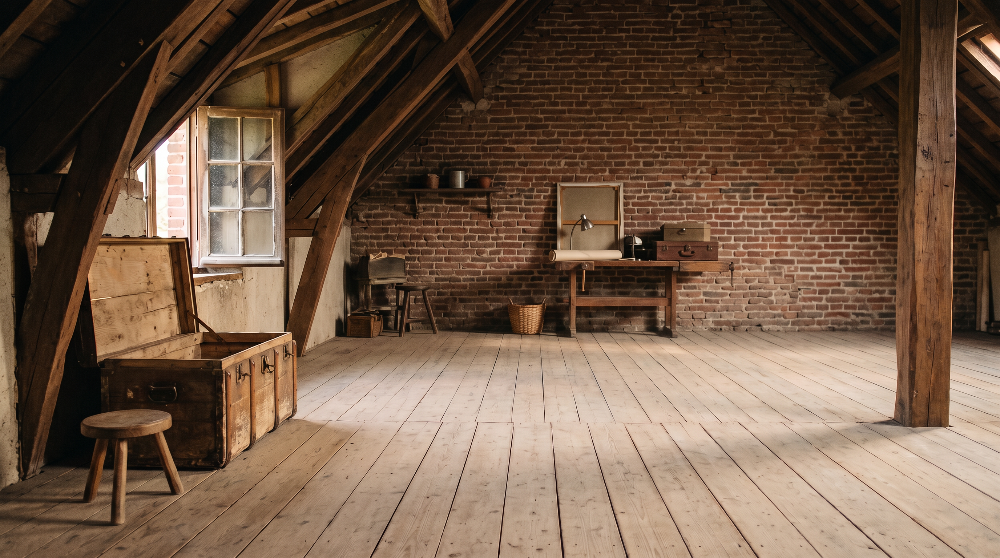
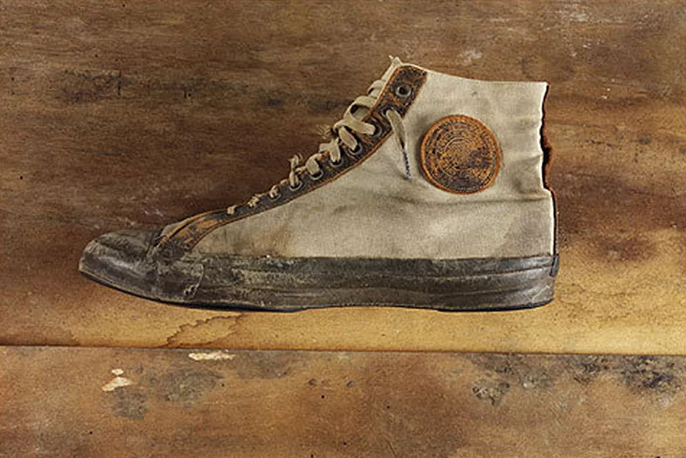

# CONVERSE — Conserve what matters

> **Version précédente / Previous version.** Le [découpage cinéma v2](converse-cinematic-script-v2.md) propose désormais 26 plans en 76 secondes et développe la mère et la grand-mère. Le présent document conserve la version de 75 secondes et l’historique des références. / [Cinematic script v2](converse-cinematic-script-v2.md) is the latest proposal: 26 shots over 76 seconds, with the mother and grandmother. This document retains the earlier 75-second version and reference history.

**Dossier de production / Production bible · v1 · 26 September 2026**

[Français](#français) · [English](#english) · [Generation briefs](#six-keyframe-generation-briefs) · [Shot list CSV](converse-shot-list-v1.csv) · [Visual board](selection/index.html)

**Mise à jour / Update:** l’équipe confirme que Converse est exempté de la contrainte de plan-séquence : les coupes sont autorisées. Les six images clés et les essais de transition sont maintenant autorisés en production. / The team confirms that Converse is exempt from the one-shot requirement: cuts are allowed. The six keyframes and transition tests are now authorized for generation.

**Statut / Status:** scénario proposé pour discussion, pas encore validé par l’équipe. Proposed script for team review, not an approved shooting script. Ce dossier consolide les notes précédentes pour la prochaine étape ; les explorations restent conservées. / This is the current working synthesis; earlier explorations remain archived.

## Français

### 1. Le film que je recommande

**Rafa parlait peu. Ses chaussures racontent ce qu’il n’a pas dit.** Après les funérailles, Luna, 15 ans, découvre dans le grenier une paire de Converse ayant appartenu à son grand-père. En les portant, elle imagine sa jeunesse, sa rencontre avec Elena et un geste d’affection envers sa fille — la mère de Luna. Elle ajoute ses initiales aux siennes et emporte son skate : l’histoire continue avec elle.

L’émotion recherchée est **le manque qui devient une connexion chaleureuse, puis un élan vers l’avenir**. La paire déclenche le voyage, traverse chaque souvenir et porte la dernière trace. Le récit suggère une mémoire subjective, sans devoir expliquer une mécanique de voyage dans le temps.

**Cible : 75 secondes, dont quatre secondes de signature sur la dernière image.** On garde cinq secondes de marge sous le maximum de 80 secondes. Signature de travail de l’équipe : **« CONVERSE. CONSERVE WHAT MATTERS. »** Ce n’est pas une signature officielle de la marque. « Communicate » reste une idée de mise en scène : communiquer par les gestes.

### 2. Ce qui est choisi, proposé ou en réserve

| Sujet | État actuel |
|---|---|
| Luna | **Choisie par l’équipe.** Identité T01/X01 ; L01/L02 développent silhouette et expressions. |
| Grand-père | **Visage G01 choisi.** G11/G15 développent l’homme âgé. G12/G13/G14 sont des propositions de rajeunissement à comparer. |
| Grenier | **D06 choisi.** R01/R02 et L05 préparent les angles et l’intégration de Luna. |
| Style | **Réalisme choisi pour cette étape.** Le passage à l’animation demeure une piste disponible, sans entrer automatiquement dans cette version. |
| Tenue de Luna | L01 sert de base provisoire. L03/L04 et les accessoires orange sont une **alternative non validée**. |
| Paire | Montantes noires de type P01 comme base de travail. Construction exacte, réparation, patine et emplacement des initiales **à fixer**. |
| Histoire | Trois souvenirs et ouverture directe dans le grenier : **recommandation de ce dossier**. |
| Biographie | Rafael « Rafa » Morales, famille portoricaine du Bronx : **fiction proposée par l’équipe**, distincte du seul choix du visage G01. |
| Nouvelle photo ancienne | **Référence de matière et d’usure**, pas un changement automatique de modèle ou de coloris. |
| État réel de la production | 73 images sur la planche, dont les six premières images de scène K01–K06. **Ce sont des candidats générés, pas des images finales verrouillées.** Trois essais vidéo de transition sont disponibles, dont TR02 recommandé pour poursuivre ; aucun film final n’est assemblé. |

Sources des décisions explicites : [creative-choices.json](selection/creative-choices.json). Les préférences enregistrées dans les navigateurs ne sont pas une sélection commune synchronisée.

| Luna — identité retenue | Grand-père — visage retenu | Grenier — décor retenu |
|---|---|---|
|  |  |  |

### 3. Ce que l’on garde de nos explorations

- **L’idée initiale du petit garçon :** l’objet hérité crée une relation avec un grand-parent disparu. Luna reprend cette fonction ; on ne développe plus deux protagonistes en parallèle.
- **La piste Rafa / Luna :** basket → danse → affection → skate donne une vie aux chaussures et un langage commun aux générations.
- **West Side Story :** énergie chorégraphiée, briques, escaliers de secours, rouges et lumière dorée. Il s’agit d’une inspiration visuelle ; nos personnages et leur histoire restent originaux.
- **Peinture, textile, papier, noir et blanc, 3D, jeu vidéo, pixels, argile et mélange des matières :** les séries S, U, H et X restent une bibliothèque d’options. On choisira éventuellement une seule règle de transformation après avoir testé le récit réaliste.
- **Le Reel Instagram :** conservé comme référence de continuité de pose entre styles. Le visionnage antérieur était partiel ; ce n’est pas une preuve qu’un morphing continu identique fonctionnera pour notre film.
- **L’IA au cimetière et le monde de 2050 :** variantes conservées, absentes du scénario principal proposé ci-dessous.

Les notes antérieures, les sources de recherche et les observations sont accessibles dans [l’index des archives](#archives-and-provenance). Leur présence ici ne transforme pas chaque idée en décision de l’équipe.

### 4. La nouvelle référence de chaussure

Le fichier ajouté au dossier est identique à l’image jointe dans la conversation. On retient **les plis de la toile, les lacets ternis, les différences de matière et l’usure irrégulière**. La date, le modèle exact et l’origine historique ne sont pas vérifiés ; le nom de fichier ne suffit pas à les établir. Une zone usée ne prouve pas non plus une réparation.

Pour notre paire noire, je recommande une patine reconnaissable et encore portable. La photo sert à observer la matière ; copier sa toile claire, sa semelle sombre et son écusson changerait le produit. Si l’équipe préfère finalement une paire écrue, il faudra remplacer la référence produit dans toutes les époques avant les images finales.

**Continuité proposée, à fixer dans une fiche produit :** même silhouette et même taille apparente ; même pied droit identifiable ; initiales R.M. discrètes sur la partie haute de la languette droite, exposée au-dessus des lacets et dégagée de l’ourlet ; petite réparation sur le quartier extérieur droit, à l’écart de l’écusson intérieur. Ne pas reprendre sans contrôle la réparation stylisée de P01. La zone L.M. reste vide jusqu’à la fin. Les lettres seront composées et suivies au montage si nécessaire.

| Époque | État proposé de la même paire | Porteur |
|---|---|---|
| 1970 | Toile noire, caoutchouc ivoire encore propre ; pas de réparation. | Rafa adolescent |
| 1977 | Premiers plis et traces, lacets un peu ternis. | Rafa jeune adulte ; Elena porte des chaussures différentes. |
| 1995 | Patine plus marquée ; petite réparation présente. | La fille de Rafa ; lui porte des chaussures d’intérieur différentes. |
| 2026 | Toile assouplie, patine et réparation conservées, semelle intacte et portable. | Luna, qui ajoute L.M. à côté de R.M. |

Cette continuité est une fiction d’objet transmis, pas une démonstration de durée de vie réelle. Les accessoires orange peuvent exister sans repeindre la paire héritée. Les bouts et talons orange restent une option de personnalisation distincte.

### 5. Une chronologie de travail unique

Pour rapprocher les fiches actuelles de G01, ce dossier propose une naissance de Rafa **vers 1954** : environ **16 ans en 1970, 23 en 1977, 41 en 1995 et 72 en 2026**. Les anciennes notes utilisaient 1955 et des âges inférieurs d’un an. Rien n’oblige à afficher ces dates à l’écran.

Luna a 15 ans en 2026. La fille de Rafa a environ 16 ans dans le souvenir de 1995 ; elle est la mère de Luna, environ 47 ans en 2026. Elena est la future compagne de Rafa. On retient la formulation **« Luna ne l’a jamais vraiment connu »**, qui permet une distance familiale sans inventer une absence totale de contact.

Le bébé de 2011, le mariage, l’achat après des économies et le départ de sa fille restent hors de cette version. On conserve leurs idées dans l’archive. Le choix G01 ne fixe pas une origine culturelle : le premier prompt de casting et la biographie Rafa différaient ; la biographie devra être confirmée comme un choix d’écriture.

### 6. Script détaillé — 75 secondes

**Mise en scène proposée :** on commence juste après l’ouverture du coffre. Luna est assise, une chaussure déjà au pied, l’autre entre ses mains. La découverte se lit dans son regard et les objets autour d’elle ; on évite de devoir montrer deux chaussages et deux nœuds complets. Son skate et un feutre débouché sont déjà visibles près du coffre.

| Temps / durée | Image et action précise | Caméra et passage | Son / intention |
|---|---|---|---|
| **00–09 · 9 s — L’absence** | D06. Un programme funéraire avec le portrait G01 est posé près du coffre ouvert. Luna touche la toile de la chaussure droite, puis la glisse à son pied. Une petite photo de Rafa adolescent est conservée dans le coffre. La paire est visible dès l’ouverture. | Départ assez large pour comprendre Luna et le coffre ; rapprochement lent vers ses mains. Un seul geste par unité de génération. | Bois, toile, souffle. Voix de sa mère hors champ : **« C’étaient les siennes. Je les lui empruntais. »** Le ton est simple, intime. |
| **09–19 · 10 s — Le contact** | Les deux chaussures sont aux pieds. Luna resserre un lacet déjà noué, regarde la petite photo, puis plante doucement le pied droit. | Caméra descend vers la semelle, mouvement latéral ; une poutre passe complètement devant l’objectif à l’entrée du souvenir. | Un frottement de caoutchouc devient celui du terrain. Le motif musical commence. Le contact, et non un rayon magique, déclenche l’évocation. |
| **19–31 · 12 s — La jeunesse / 1970** | Rafa adolescent, dérivé de G12, sur R03. Ballon tenu contre la hanche, un pivot simple puis un sourire vers quelqu’un hors champ. Sa tenue et son visage reprennent la photo du coffre. | Même hauteur de caméra à l’entrée ; elle remonte assez pour lire son visage, puis retrouve son pas. Un poteau proche masque le passage suivant. | Rebond entendu hors champ, semelle et ambiance de cour. On découvre son énergie. Pas de dribble complexe ni de saut spectaculaire. |
| **31–43 · 12 s — La rencontre / 1977** | Rafa dérivé de G13, dans R05. Elena lui offre la main. Après une brève hésitation, il la prend et fait un seul pas de danse avec elle. Ses Converse restent visibles ; elle porte d’autres chaussures. | Le pas prolonge le pivot précédent. Mouvement latéral mesuré ; une épaule proche occulte la sortie du souvenir. | La percussion prolonge le rythme du terrain ; couleur salsa. Un rire discret. On comprend sa timidité puis sa joie. |
| **43–57 · 14 s — L’affection / 1995** | Dans R06, la mère de Luna adolescente porte la paire. Rafa, environ 41 ans, remarque un nœud déjà formé mais desserré. Il feint un petit reproche, s’accroupit et resserre doucement le lacet ; elle sourit. | Entrée au niveau des chaussures, puis visages. Le laçage est un seul resserrement, pas un nœud compliqué. Retour au présent par une occultation proche du pantalon. | Ambiance de maison, frottement du lacet ; la musique s’allège. La phrase de la mère entendue au début donne son sens à cette scène. |
| **57–75 · 18 s — La suite / 2026** | Retour dans D06 : Luna, accroupie, touche le même endroit de la chaussure et prend le feutre posé près d’elle. Elle ajoute L.M. sur la languette, près de R.M. Elle se relève, prend son skate et fait deux pas vers la sortie du grenier, apaisée. | 57–63 : retour, respiration et prise du feutre ; 63–69 : trace au feutre ; 69–75 : départ. Réserver un espace lisible pour la signature **71–75**, superposée à l’image. Pas de carton séparé. | Le grenier revient, mais le motif musical reste. Roues du skate soulevé, pas nets ; fin chaleureuse. Aucun autre slogan. |

La seule réplique proposée identifie la transmission mère → fille sans ajouter un visage adulte à caster. Version anglaise recommandée pour le premier essai : **“They were his. I used to borrow them.”** Une seule langue parlée dans le film ; la traduction peut être sous-titrée. On peut tester une version sans voix, mais la filiation devra alors être comprise autrement.

**Vérification narrative :** une personne extérieure doit comprendre que le jeune homme est le grand-père, que la fille de 1995 est la mère de Luna et que la même paire relie les trois générations. Si l’une de ces relations reste obscure, on corrige la photo ou le son avant de multiplier les plans.

### 7. Montage libre — clarification confirmée

**L’équipe a confirmé que Converse fait partie des marques suggérées et est exempté de la contrainte de plan-séquence.** Cette contrainte ne concernait que les équipes choisissant une autre marque. On peut donc utiliser des coupes franches, des gros plans, des changements d’axe et des ellipses. La mention du PDF reste dans l’archive du brief, mais ne bloque plus cette production.

Les passages par une poutre, un poteau ou une épaule décrits dans le premier script sont désormais des **options stylistiques**, jamais des obligations. Pour cette première série, comparer trois méthodes sur la même paire d’images : raccord sur l’impact du pied, panoramique filé et surimpression photographique du souvenir. Le produit et la direction du geste doivent rester lisibles ; la caméra peut changer de plan.

Luna vit une évocation subjective dans le grenier. La sixième image de cette série la montre partir avec son skate. Un plan extérieur sur le terrain de 2026 peut ensuite remplacer une partie de la fin grâce à une ellipse assumée, sans ajouter de durée au film.

### 8. Les six premières images clés générées

**K01–K06 existent maintenant** dans la planche, onglet « Scènes & transitions ». Les demandes ci-dessous conservent notre intention initiale ; les résultats et leurs écarts sont documentés sous les images et dans les journaux. Ce sont des candidats pour démarrer les scènes, pas encore des références finales approuvées.

| Image cible | Références existantes | Image à obtenir / vérification |
|---|---|---|
| **K01 · Découverte, vers 04 s** | Luna T01/X01 + L01 ; D06 ; L05 comme composition ; G01 pour le programme | Luna assise, chaussure droite en main, gauche déjà au pied. Coffre, skate, feutre et photo établis. Vérifier taille de la paire et nombre de chaussures. |
| **K02 · Contact, vers 17 s** | Même Luna/tenue/paire ; D06/R02 ; X01 comme référence de cadrage seulement | Pied droit entièrement posé, chaussure stable, zone de réparation lisible. X01 a encore la pointe levée et ne constitue pas cette image finale. |
| **K03 · Jeunesse, vers 25 s** | G12 à retenir/corriger ; R03 ; nouvelle fiche produit état 1970 | Même jeune visage que la photo du coffre ; pivot simple, semelle lisible, ballon tenu. T02 reste une étude de composition, antérieure au choix G01. |
| **K04 · Rencontre, vers 37 s** | G13 ; R05 ; Elena à définir ; paire état 1977 | Main offerte et hésitation lisible. T03 guide l’ambiance, mais son casting et la paire d’Elena ne sont pas verrouillés. |
| **K05 · Transmission, vers 50 s** | G14 corrigé ; R06 nettoyé ; mère adolescente à définir ; paire état 1995 | Une seule paire héritée, aux pieds de la fille. Rafa porte d’autres chaussures. Même geste de lacet que Luna. |
| **K06 · Continuer, vers 70 s** | Luna retenue ; D06 ; paire état 2026 ; T08 comme idée seulement | Luna prend son skate et se relève. Initiales ajoutées ; espace pour le texte final. Pas de lettres parasites sur son bras. |

La [liste CSV des 13 unités d’action](converse-shot-list-v1.csv) répartit exactement 75 secondes. Ce sont des repères de montage, **pas treize rendus déjà commandés ni des durées promises par un modèle**. On pourra réunir des unités dans un clip si le mouvement reste fiable. Les six briefs de génération en anglais figurent à la fin du dossier.

### 9. Ordre de fabrication recommandé

1. **Décider pendant 20 minutes.** Confirmer cette ouverture sans téléphone, les trois souvenirs, la tenue de Luna et la paire. Choisir les rajeunissements. Le montage libre est confirmé pour Converse.
2. **Préparer le minimum manquant.** Fiche produit avec vues droite/gauche et états d’usure ; photo du jeune Rafa ; Elena ; mère adolescente. Corriger G14 trop âgé, le tabouret renversé de R01 si utilisé, le fil de R06 et l’échelle de la chaussure de L05. Les décors et costumes doivent être prêts avant de composer les scènes.
3. **Comparer deux modèles sur une seule image.** K01, mêmes références et même cadrage ; vérifier visage, paire et D06. Lire le catalogue Arcads et les coûts au moment de lancer. Les résultats antérieurs à 0 crédit ne garantissent pas ceux des prochains appels.
4. **Créer K01–K06 avec la recette retenue.** Une image de récit par étape. Approuver l’identité et la compréhension avant l’animation.
5. **Faire une animatique de 75 secondes.** Placer les six images sur une timeline avec la réplique et une musique provisoire. Cette animatique teste les coupes et le rythme du récit avant les rendus vidéo.
6. **Tester seulement le raccord le plus important.** Court essai du contact chaussure/sol et de l’entrée dans le souvenir, sur quelques secondes. Comparer au plus deux modèles vidéo avec les mêmes images, si disponibles. Conserver celui qui maintient la paire, le pied, le visage et le mouvement.
7. **Générer les séquences utiles, monter tout de suite.** Une action simple par demande. Garder les prompts, références, essais et coûts ; réutiliser les sorties approuvées comme références de continuité quand l’outil le permet. Tester aussi le geste de lacet et la main tendue avant les versions longues.
8. **Finaliser le son, le texte et les exports.** Le nom de marque, les initiales et la signature doivent être lisibles. Regarder le film entier, image et son, puis enregistrer la face caméra de moins de 60 secondes.

**Répartition possible à trois :** une personne tient le récit, le montage et le minutage ; une personne suit casting, produit et générations ; une personne prépare son, références, contrôle et face caméra. Un même responsable de montage rassemble les exports pour éviter trois versions divergentes.

Au moment de cette consolidation, samedi vers **17 h 10 à Paris**, il reste environ **20 h 50** jusqu’à la limite de dimanche 14 h indiquée dans le brief. Objectifs proposés : scénario et montage ce soir avant les rendus longs ; première version complète samedi soir ; image verrouillée dimanche matin ; son, face caméra et exports avant midi ; dépôt visé **13 h 30**. Ajuster à la réalité des rendus. Si le film devient trop lourd, retirer la salsa en premier : basket → père/fille → Luna préserve la transmission et réduit le casting et les lieux.

### 10. Livrables et décisions encore nécessaires

Le brief fourni prévoit le film **≤80 s** et une explication face caméra **≤60 s**. La page 18 demande : inspiration, concept, fabrication, difficultés, accomplissements, apprentissages, suite et outils. Trame de face caméra à compléter **avec ce qui aura réellement été fait** :

> Nous voulions raconter ce qu’un objet peut transmettre quand quelqu’un n’est plus là. Luna découvre son grand-père à travers une paire de Converse. Notre inspiration principale était [référence retenue]. Nous avons utilisé [outils réellement employés] pour [méthode réelle]. Le principal défi a été [problème rencontré]. Nous sommes fiers de [résultat visible] et nous avons appris [apprentissage concret]. Nous aimerions ensuite [suite].

Chronométrer la prise, viser 50–55 secondes et couvrir les huit thèmes sans annoncer comme terminée une étape seulement prévue.

**À décider pour lancer les images finales :** ouverture directe ou variante IA ; tenue d’origine ou accessoires orange ; paire noire ou nouvelle direction écrue ; jeunes versions de Rafa et les deux rôles secondaires. La signature et la biographie restent des propositions à confirmer avec l’équipe. Le ratio **16:9 est une hypothèse de travail**, à rapprocher des consignes de dépôt ; résolution, codec et poids final restent à vérifier dans celles-ci.

La variante IA remplacerait les premières secondes, sans s’ajouter au film : Luna consulte un écran fictionnel, reçoit une réponse invitant à chercher une trace personnelle, puis découvre la paire. Elle demanderait de revoir le temps du chaussage. La variante 2050 et le changement réaliste → animé restent des concepts séparés, pas des ajouts de dernière minute à cette version.

## English

### Working concept and decision status

**Rafa did not say much. His shoes tell the stories he never told.** After the funeral, fifteen-year-old Luna finds her grandfather’s Converse in the attic. Wearing them opens a subjective journey through his youth, his first encounter with Elena and a quiet act of care for his daughter — Luna’s mother. Luna adds her initials and picks up her skateboard: she will carry the story forward.

Target emotion: **absence → connection → forward momentum**. Working team tagline: **“CONVERSE. CONSERVE WHAT MATTERS.”** This is an original proposal, not an official brand tagline. Target runtime: **75 seconds including four seconds of end text**, five seconds below the 80-second limit.

**Selected by the team:** Luna’s T01/X01 identity, grandfather G01, attic D06, photographic realism for the current development stage. **Proposed, not selected:** this script, the younger grandfather interpretations, orange costume, final shoe construction and markings, supporting cast, exact biography and final visual treatment. There are now 73 stills on the board, including the first six generated scene candidates K01–K06. Three short transition tests are available, with TR02 recommended for further development; see the separate transition comparison. There is no assembled final film or team-locked set of final keyframes.

This document is the current synthesis for the next production step. The earlier boy, cemetery/AI opening, 2050 concept and illustrated/clay/pixel treatments remain archived options. They are not simultaneous requirements. The current photographic baseline can later support one coherent style-change rule if the team chooses it.

### Shoe reference and story continuity

The newly supplied antique-looking shoe is saved in this repository and displayed above. Its date, exact model and provenance are **unverified**. Use its canvas creases, dull laces and uneven material wear as reference. Its light canvas, dark rubber and badge construction do not automatically replace the working black high-top pair.

Proposed product continuity: stable construction and proportions; R.M. on the exposed upper right tongue, above the laces and clear of the trouser hem; a small repair on the outer right canvas quarter, away from the inner ankle badge; space for L.M. remains empty until the ending. Build a proper left/right reference before final images. Do not copy P01’s stylized repair without checking it. Initials can be composited and tracked in the edit.

The pair is relatively fresh in 1970, lightly worn in 1977, repaired by 1995, and worn but intact in 2026. In the dance scene Elena wears different footwear. In 1995 the daughter wears the inherited pair while Rafa wears different house shoes. The orange accessories do not require orange paint on the inherited shoes. Fictional inheritance is not a verified durability claim.

For consistency with the latest G01 development, propose Rafa born **around 1954**, approximately **16 / 23 / 41 / 72** in **1970 / 1977 / 1995 / 2026**. Earlier notes used 1955; this is one working replacement, not two parallel timelines. Luna is 15 in 2026. Her mother is approximately 16 in the 1995 memory and 47 in 2026. Luna **never really knew him**, rather than necessarily never meeting him. Omit the wedding, savings/purchase, departure and 2011 baby scenes from this version. The G01 face selection does not establish ethnicity; the team’s Puerto Rican Bronx biography remains a writing proposal.

### Detailed 75-second script

Start immediately after the chest was opened: Luna sits with one shoe already on and the other in her hands. The discovery is communicated through her gaze, the chest and personal objects. Her board and an uncapped marker are already nearby. This avoids two full shoe changes and complex knot-tying.

| Time | Picture and performance | Camera, sound and transition |
|---|---|---|
| **00–09 — Absence** | D06. A funeral programme with the G01 portrait rests beside the open chest. Luna feels the right shoe’s canvas, then slips it on. A small photograph shows teenage Rafa. The product appears immediately. | Slowly approach her hands. Wood, fabric, breathing. Her mother, off screen: **“They were his. I used to borrow them.”** No present-day mother face is needed. |
| **09–19 — Contact** | Both shoes are on. Luna tightens one already tied lace, glances at the photograph and gently plants her right foot. | Move down to the sole, then laterally behind a foreground beam. Rubber on wood becomes rubber on court. The contact motivates the memory. |
| **19–31 — Youth, 1970** | G12-derived Rafa holds a basketball at his hip on R03. One simple pivot; a smile to someone off screen. His face and clothing match the chest photograph. | Enter low, rise enough to read his face, return to his step. A nearby post masks the next transition. Court ambience and an off-screen ball bounce. No complex dribbling. |
| **31–43 — Love, 1977** | G13-derived Rafa in R05. Elena offers her hand. He hesitates, accepts it and they share one simple dance step. His Chucks are visible; her shoes differ. | Continue the previous footwork and measured lateral motion. A close shoulder occludes the exit. Percussion develops into the salsa scene; a small laugh. |
| **43–57 — Care, 1995** | The teenage mother wears his pair in R06. Rafa, around 41, notices an already formed but loose bow, gives a tiny mock-disapproving look, crouches and tightens it. She smiles. | Start at shoe level, allow both faces to read, then a trouser-leg occlusion carries the return. One lace pull, not an intricate knot. The opening maternal line establishes whose memory this is. |
| **57–75 — Continuation, 2026** | Luna crouches in D06, touches the same place on the shoe and picks up the nearby marker. She adds L.M. next to R.M., rises, picks up her board and takes two steps towards the attic exit. | 57–63 return, breath and marker pickup; 63–69 marker stroke; 69–75 departure. Overlay the tagline **71–75** on the image. Attic ambience returns but the music remains. No separate end card. |

Use one spoken language; English is proposed for the first test. The French equivalent is “C’étaient les siennes. Je les lui empruntais.” Subtitles can translate it. A silent version is possible if the mother’s identity remains clear. Test the story with an outsider: do they understand young Rafa, Luna’s mother and the one inherited pair?

### Free editing — confirmed clarification

**The team confirms that Converse is a suggested brand and therefore exempt from the one-shot requirement.** That rule applied only to teams choosing a different brand. Visible cuts, inserts, camera-angle changes and time ellipses are allowed. The original slide remains part of the brief archive, but this issue no longer blocks production.

The beam, post and shoulder occlusions in the original draft are now optional visual devices. Compare three techniques on the same reference pair: a foot-impact match cut, a whip pan and a photographic memory dissolve. Keep the product and gesture readable; the camera does not have to remain continuous.

Luna experiences a subjective memory while in the attic. The sixth image in this batch shows her leaving with her board. A later exterior skating shot on the 2026 court may replace part of the ending through a normal time ellipse, without extending the total runtime. The AI opening, 2050 concept and animation switch remain separate options.

### Keyframes, missing assets and production order

**K01–K06 are now generated candidates in the Scenes & transitions tab:** K01 discovery; K02 foot contact; K03 teenage Rafa; K04 Elena’s offered hand; K05 father/daughter lace gesture; K06 Luna moving forward. The French reference table above lists the source assets, and the English generation briefs below are ready for refinement after choices are locked. The [CSV](converse-shot-list-v1.csv) splits the 75 seconds into 13 simple action units; it is an editorial plan, not 13 submitted jobs or guaranteed model durations.

Before final keyframes: fix the shoe reference and four wear states; choose G12/G13/G14 interpretations; establish Elena and the teenage mother; produce the teenage photo and funeral programme prop. Correct G14’s overly mature appearance, R01’s overturned stool if used, R06’s stray foreground cord and L05’s shoe scale. T02–T04 predate the G01-derived casting and are composition studies. T05’s pair looks too new; T08 contains unwanted arm lettering. Do not propagate these artifacts.

Recommended sequence:

1. Spend 20 minutes settling the opening, three memories, Luna costume, pair and younger faces; use the now-confirmed freedom to cut between shots.
2. Prepare the missing character/product references and clean chosen locations.
3. Compare at most two available image models on **the same K01 brief and references**. Check the live Arcads catalogue and costs before generation; previous zero-credit results do not guarantee future pricing.
4. Produce the six keyframes with the chosen setup and check identity and storytelling.
5. Build a 75-second **animatic**: still images on a timeline with temporary sound. Use cuts and temporary sound to test the narrative rhythm before generating motion.
6. Make a short foot/contact-to-memory motion test. If available, compare at most two video models using the same inputs. Evaluate shoe, foot, face and camera continuity. Test the lace and offered-hand gestures before long renders.
7. Generate useful segments and edit as they arrive. Keep one action per request and record prompts, references, attempts, outputs and costs. Derive additional transition frames as needed.
8. Finish sound, tracked markings, clean brand text and exports; record the explanation video.

Possible three-person ownership: **story/edit/timing**, **cast/product/generation**, **sound/references/QA/face camera**. One editor owns the master timeline. At this document’s creation, Saturday around **17:10 Paris**, approximately **20 h 50** remained before the Sunday 14:00 deadline in the supplied brief. Aim for a complete rough film Saturday night, picture lock Sunday morning, exports before noon and submission by **13:30**. If complexity becomes excessive, drop salsa first: youth → father/daughter → Luna retains the central emotional transmission with fewer people and locations.

### Deliverables and open decisions

Main ad **≤80 seconds**. Face-camera explanation **≤60 seconds** covering inspiration, concept, process, challenges, accomplishments, learning, next steps and tools. Use completed work in that explanation, not planned results. Rehearse for 50–55 seconds. Example structure:

> We wanted to show what an object can pass on after someone is gone. Luna discovers her grandfather through a pair of Converse. Our main inspiration was [selected reference]. We used [actual tools] to [actual process]. Our biggest challenge was [observed problem]. We are proud of [visible result], and we learned [specific lesson]. Next, we would [realistic next step].

The exact delivery ratio, resolution, codec and file-size limit remain to be checked. **16:9 is a working assumption.** The script, tagline, biography, wardrobe, final pair and supporting cast still need the team’s choices; only Luna’s face, G01, D06 and the current realistic test direction have been explicitly selected.

### Lecture de la première série / First-batch review

- **K01 :** deux chaussures et Luna conservées ; le programme reste au sol et la petite photo jeune a disparu. Replacer les accessoires avant le film. / Two shoes and Luna preserved; the programme stays on the floor and the young photograph disappeared. Re-establish prop continuity before the film.
- **K02 :** semelle correctement posée ; standardiser la petite réparation crème. / Grounded sole; standardize the small cream repair.
- **K03 :** animer à partir du ballon réellement tenu à la hanche droite. / Animate from the actual ball position at his right hip.
- **K04 :** Elena porte des talons distincts ; le pantalon de Rafa masque la tige. / Elena wears distinct heels; Rafa’s trousers hide most of the high-top collars.
- **K05 :** le fil est retiré et la patine renforcée ; Rafa tient le lacet gauche de sa fille. / Cord removed and wear increased; Rafa holds his daughter’s left shoelace.
- **K06 :** expression apaisée et skate lisibles ; corriger l’écusson extérieur et harmoniser ourlets, photos et planche de skate. Les initiales et la signature restent à composer. / Clear softer expression and board; correct the outer ankle badge and harmonize hems, photographs and board. Initials and tagline remain to be composited.

Les corrections ciblées sont conservées dans les archives. Les six scènes ont nécessité neuf générations d’images, à 0 crédit facturé déclaré par Arcads. / Targeted corrections are archived. The six scenes required nine image generations, charged at 0 credits as reported by Arcads.

[Comparatif présent → souvenir / Present-to-memory comparison](converse-transition-tests-v1.md) · [TR01](selection/assets/TR01.mp4) · [TR02](selection/assets/TR02.mp4) · [TR03](selection/assets/TR03.mp4)

## Six keyframe generation briefs

**Original planning briefs. The first six candidates have now been generated; exact executed prompts, reference paths and revisions are in the two keyframe generation logs.** Supply actual reference images through the chosen tool; asset codes in text alone do not provide visual conditioning. First define the product master and supporting cast. Keep the selected Luna outfit consistent in K01/K02/K06; the default below is L01 until the team chooses otherwise. Reference order: identity → product → location → composition. Treat 16:9 as provisional.

### K01 — Discovery

References: T01/X01 identity, L01 wardrobe, D06 room, approved 2026 shoe master, G01 funeral portrait, G12 teenage photograph after casting selection. L05 is a composition aid only.

> Photorealistic cinematic still, horizontal 16:9. Preserve the exact fictional teenage Luna from the identity references, her youthful facial proportions, dark curly hair and restrained expression. She sits on the upright wooden stool beside the open chest in the supplied D06 attic, wearing the selected charcoal tee and olive cargo trousers. The inherited left black high-top is already on her left foot. She holds its matching right shoe, loosened and ready to put on; her right foot is in a plain sock. Exactly two shoes from this pair exist in the frame. Preserve their approved size and construction. A modest funeral programme with the older grandfather portrait rests beside the chest, with a small photograph of his younger self inside. Her skateboard leans within reach and an uncapped marker rests on the chest edge. Quiet diffuse window light, believable skin and fabric, intimate and restrained. No glowing box, no extra people, no invented tattoos. Leave prop lettering blank for compositing. Establish readable spatial relationships for a subsequent shots.

### K02 — Contact

References: approved K01, product master right side and tongue, D06/R02 for geometry. X01 is framing inspiration only.

> Photorealistic low cinematic frame in exactly the same attic, with the same Luna, costume and inherited pair as the approved preceding frame. Both shoes are now correctly worn. Her right sole rests fully and naturally on the wooden floor, heel and forefoot grounded, with believable ankle anatomy and scale. Show the approved outer-right repair without moving or inventing an ankle badge. Keep the left foot clearly separate. The camera is ready to track gently sideways towards the existing foreground beam; retain visible space around the shoe for motion. Natural diffuse light and tactile canvas. No raised toe, no double soles, no extra footwear, no floating foot, no material transformation yet. Do not fabricate text.

### K03 — Youth

References: selected G12 identity/wardrobe, R03 court, shoe master in 1970 state. Use this identity for the photograph in K01 too.

> Photorealistic cinematic frame of the selected younger version of G01, approximately sixteen, on the supplied 1970 court. Preserve the approved young face, dark curls, white athletic vest, navy shorts and tube socks. He holds a basketball against his hip and settles into one modest basketball pivot, both legs anatomically clear. His black high-tops have the approved construction in their early lightly worn state, without the later repair. One relaxed smile towards a friend outside the frame. Preserve the court layout, chain-link fence, brick buildings and fire escapes from R03. Warm believable late-day light. Full enough framing to read his face and shoes, with a nearby foreground post available for the camera transition. No crowd choreography, no jumping, no additional cast, no captions.

### K04 — Love

References: selected G13, newly established Elena identity, R05, shoe master 1977 state. T03 is mood/composition only.

> Photorealistic intimate scene in the supplied late-1970s dance hall. Preserve the approved twenty-three-year-old Rafa derived from G01, his rust patterned open-collar shirt and brown flared trousers. Preserve the approved Elena identity. Elena gently offers one hand; Rafa has not yet taken it and shows a shy, natural half-smile. Their bodies are prepared for a single easy shared step, not an elaborate dance. Rafa alone wears the inherited black high-tops in their 1977 wear state; Elena wears simple different low-heeled shoes. Warm wood, restrained red and plum light, soft golden highlights. Keep both faces, hands and Rafa’s shoes readable. Natural hand anatomy, no duplicate arms, no unrelated dancers in the foreground, no generated text.

### K05 — Care

References: corrected G14, new teenage mother identity, cleaned R06, shoe master 1995 state.

> Photorealistic cinematic family moment in the supplied 1995 living room. The approved teenage daughter sits with the inherited black high-top pair on her feet, in their approved repaired 1995 state. Rafa, the same grandfather at approximately forty-one with the approved face and moustache, crouches beside her right foot. His hands are positioned for one gentle pull on an already formed lace bow. He wears clearly different plain house shoes, with no duplicate inherited pair elsewhere. The daughter gives him a small knowing smile. Preserve the room layout, warm domestic light and uncluttered floor; omit the stray cable from the location study. Keep all hands and feet anatomically plausible and distinguish the two characters. No invented tattoos or readable text.

### K06 — Continuation

References: approved K01/K02 Luna and room, approved 2026 product, board position established in K01. T08 is a narrative idea only.

> Photorealistic cinematic ending in exactly the established D06 attic. Same teenage Luna, unchanged face, hairstyle and chosen costume, wearing the same correctly scaled inherited black high-top pair. She is rising from the stool area with her skateboard held naturally at her side, ready to take two ordinary steps towards the attic exit. Her expression has softened into a small private smile. The chest remains open, the photograph stays in its established place, and the marker has been put back down. Reserve the exposed upper right-tongue area, above the laces and clear of the trouser hem, for the added initials in postproduction; do not invent lettering. Keep a quiet uncluttered area for the final brand line without obscuring her face or shoes. Slightly warmer emotional impression through performance and existing light, not a new sun position. No extra shoes, no forearm writing, no outdoor location, no generated logo or captions.

## Archives and provenance

| File | Role |
|---|---|
| [Original hackathon slides](../generathon2final.pdf) | Brief source: pp. 14/16 one-shot wording, p. 17 brand challenge, p. 18 deliverables; schedule pp. 6–7. Other tracks’ instructions are not requirements for this ad. |
| [Explicit creative choices](selection/creative-choices.json) | Team-confirmed choices; this proposed script does not silently overwrite them. |
| [Luna character bible](luna-character-bible-v1.md) | Latest realistic identity, costume, age studies and location notes. |
| [Initial direction](converse-direction-v1.md) | Earlier boy/one-memory proposal and brand research links. Historical plan, not the current script or current tool catalogue. |
| [Team directions](converse-team-directions-v3.md) | Rafa/Luna development, earlier 70-second draft, alternate AI/2050 ideas and research sources. |
| [Style-switch exploration](converse-style-switch-v4.md) | Material-change proposal and observations from the supplied Reel. Stills, not validated motion. |
| [Reference registry](selection/references/index.json) | Supplied examples and observed vs proposed uses, including the old shoe. |
| [Asset manifest](selection/manifest.json) | Existing generated images and reference lineage. Includes the first K01–K06 candidates; these are not team-approved final frames. |
| [Character/location generation log](selection/character-location-generation-log.json) | Actual completed generation records, prompts, costs and corrections. |

**Version policy:** change this working dossier and shot list together when timing or story changes. Record newly approved decisions explicitly in `creative-choices.json`; do not rewrite earlier explorations as though they had always been final. Keep generated media and prompt histories attributable to their actual references and models.
